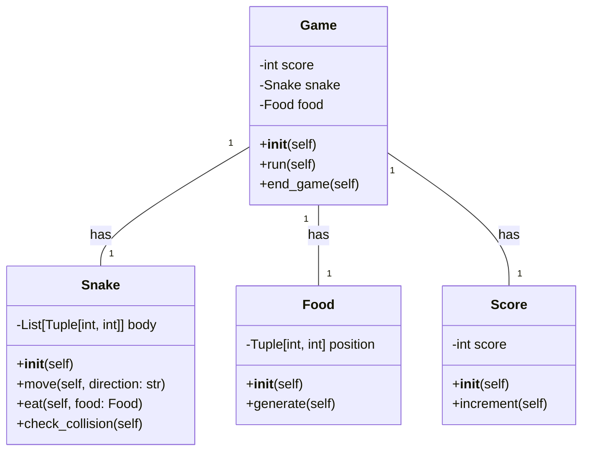
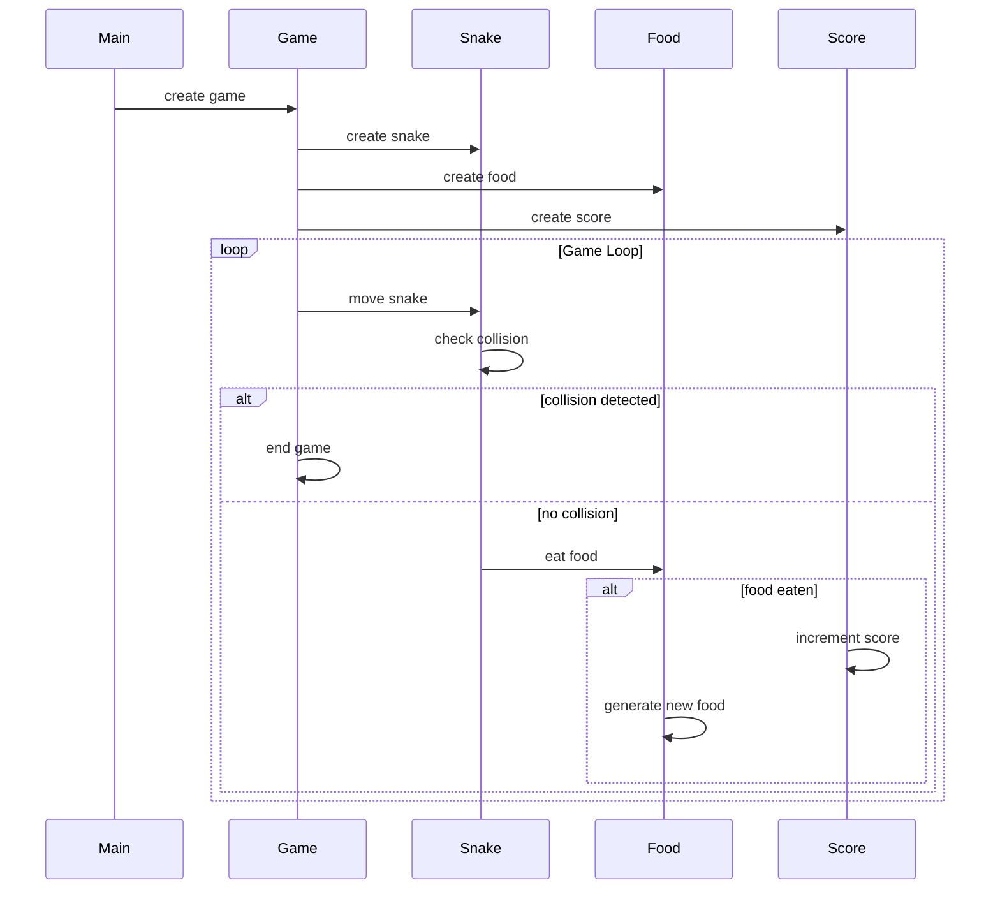

## Implementation approach
We will use the curses library in Python, which is an open-source tool for creating text-based user interfaces and handling multi-window text I/O. This library will be used to create the game board and handle the keyboard inputs for controlling the snake. The snake will be represented as a list of coordinates, and its movement will be implemented by adding a new coordinate to the front of the list and removing the last one. The food will be represented as a single coordinate. The scoring system will be implemented by incrementing a score variable each time the snake eats the food.

## Python package name
```python
"cli_snake_game"
```

## File list
```python
[
    "main.py",
    "game.py",
    "snake.py",
    "food.py",
    "score.py"
]
```

## Data structures and interface definitions


## Program call flow


## Anything UNCLEAR
The requirement is clear to me.